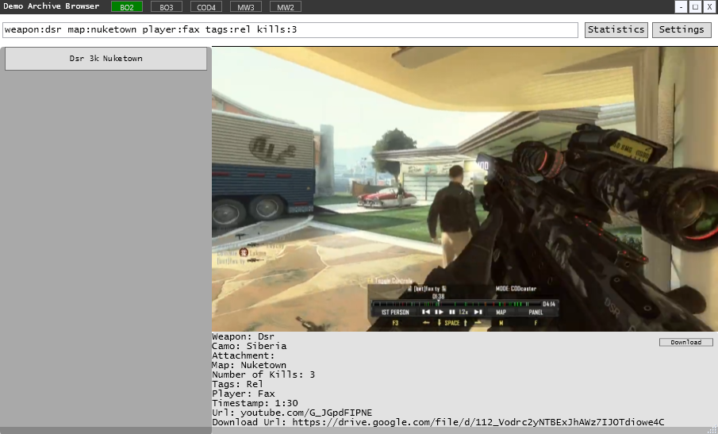

<h1 align="center">
  Demo Archive
</h1>

  

## Overview

**As more demos are uploaded the archive will update on your version as well, eliminating the need to re-download.

## Search Filters

Use the following search filters to refine your results:

- **weapon or w**
- **camo or c**
- **attachment or a**
- **map or m**
- **kills or k** (number of kills in demo)
- **tags or t** (there's a list of these if you click statistics in the top right corner) e.g. explosion, js, ns
- **location or l** (this only applies to certain maps, click on maps in the top right when cod 4 is selected for the gui)
- **player or p**
- **url or u** (to search by youtube url)

Search Operators:

- **&** (to search for demos that contain multiple of the same filter)
Example query: `weapon:dsr&ballista` this would search for demos that have both ballista and dsr in them.

- **/** (to search for demos that contain either or)
Example query: `weapon:dsr/ballista` this would search for demos that have dsr or ballista in them, but not required to be in the same demo.

- **!** (to remove a value from the search)
Example query: `!weapon:dsr` this would search for all demos that DONT have a dsr in them.

## Example Query

_Make sure you have a space between search filters and no space after the colon._

Example query: `weapon:dsr map:nuketown player:fax tags:rel kills:3`

  

